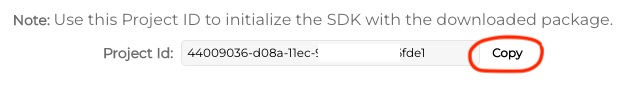
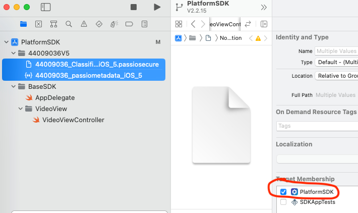

# Passio Platform iOS SDK

## Overview

Welcome to Passio Platform iOS SDK!

When integrated into your app, the SDK provides you with on-device computer vision for your project. 

The SDK creates a video preview layer that passes frames through computer vision network. The predictions for each frame of the video are provided into the preview layer and you can use them to build experiences.

By default the SDK does not record or store any photos or videos. Instead, as the end user hovers over an item with their camera phone, the SDK recognizes and identifies items in real time. This hovering action is transitory and temporary while the end user is pointing the camera at a particular item and is not recorded or stored within the SDK. As a developer, you can configure the SDK to capture images or videos and store them in your app if you need to, but by default the SDK does not capture user data. 

## Minimum Requirements

In order to use the PassioSDK your app needs to meet the following minimal requirements:
* The SDK will only run on iOS 13 or newer. 
* Passio SDK can only be used on a device and will not run on a simulator
* The SDK requires access to iPhone's camera

## Before you start testing the SDK: Download the Models and get the key from the platform.

1. Login into the platform https://platform.passiolife.com/ 
2. Under Project Status click on the "Continue" button on right of your project row. 
3. Under SDK Packaging select the latest Version (or any other desired version) and click on the "Details"
4. Copy the Project ID at the bottom of the page. You will use it to configure the SDK to run your models. 



5. Download the iOS Package to your Mac and unzip it. 
6. Drag and drop the files to your Xcode Project Navigator




## Run the DemoAppPlatformSDK

  A fast and easy way to get started with the SDK is to test it inside of PlatformSDKDemoApp included in this package. Here are the steps:
  
  1. Open the project in Xcode:
  2. Get the key from the platform. Click on your profile "My Organization" https://platform.passiolife.com/organization . The Mobile SDK Key should be copied from here above
  3. Drag ad Drop the models as described below. 
  4. In the ```VideoViewController```, replace both the key and the projetID replace.  You will have to do the same when you install the SDK your App too.  
```swift 
let key = "Your_SDK_Key"  
let projectID = "Your_projectID"
```
  5. Connect your iPhone and run
  6. Modify the app bundle from "com.PassioDemoApp.demo" to "com.yourcompany...."
  7. Run the demo app on your iPhone.

***


## Add the swift package to your project

1. Open your Xcode project.
2. Go to File > Swift Packages > Add Package Dependency.
3. In the "Add Package Dependency" dialog box, paste the URL: https://github.com/Passiolife/Passio-Platform-iOS-SDK-Distribution
4. Click "Next". Xcode will validate the package and its dependencies.
5. In the next dialog box, you'll be asked to specify the version or branch you want to use. You can choose main for the latest version or specify a specific version or branch.
6. After you've made your selection, click "Next".
7. You'll then be prompted to select the targets in your project that should include the package. Check the boxes for the targets you want to include.
8. Click "Finish" to add the package to your project.
9. Xcode will download and add the PassioPlatformSDK to your project. You can now import and start using the PassioPlatformSDK.

### Edit your Info.plist

* If opening from Xcode, right click and select 'open as source code'
* To allow camera usage add:

 ```XML
`<key>NSCameraUsageDescription</key><string>For real-time recognition</string>`.
```

* To allow the data collection API (please contact support@passiolife.com for more information) add:

 ```XML
`<key>NSMicrophoneUsageDescription</key>
 <string>To record videos with sound for classification</string>`
 `<key>NSPhotoLibraryAddUsageDescription</key>
 <string>To select images and videos for classification</string>`
```

***

### Initialize and configure the SDK

1) At the top of your view controller import the PlatformSDK and AVFoundation

```swift
import AVFoundation
import PassioPlatformSDK
```

2) Add the following properties to your view controller. 

```swift
let passioSDK = PassioPlatformAISDK.shared
var videoLayer: AVCaptureVideoPreviewLayer?
```

3) In viewDidLoad configure the SDK with the Key you have received form Passio. 

```swift 
override func viewDidLoad() {
        super.viewDidLoad()
        #error("Replace the SDK Key and the project ID. Description how to find then above.")
        let key = "Your_SDK_Key"
        let projectID = "Your_projectID"
        var passioConfig = PassioConfiguration(key: key)
        passioConfig.projectID = projectID
        passioSDK.configure(passioConfiguration: passioConfig) { status in
            print( "SDK status = \(status)")
        }
        passioSDK.statusDelegate = self
    }
```

4) You will receive the PassioStatus back from the SDK.

```Swift
public struct PassioStatus {
    public internal(set) var mode: PassioSDK.PassioMode { get }
    public internal(set) var missingFiles: [PassioSDK.FileName]? { get }
    public internal(set) var debugMessage: String? { get }
    public internal(set) var activeModels: Int? { get }
}

public enum PassioMode {
    case notReady
    case isBeingConfigured
    case isDownloadingModels
    case isReadyForDetection
    case failedToConfigure
}
```

5) In `viewWillAppear` request authorization to use the camera and start the recognition:

```swift
override func viewWillAppear(_ animated: Bool) {
        super.viewWillAppear(animated)
        if AVCaptureDevice.authorizationStatus(for: .video) == .authorized { // already authorized
            setupVideoLayer()
        } else {
            AVCaptureDevice.requestAccess(for: .video) { (granted) in
                if granted { // access to video granted
                    DispatchQueue.main.async {
                        self.setupVideoLayer()
                    }
                } else {
                    print("The user didn't grant access to use camera")
                }
            }
        }
    }

  ```

6) Add the method `setupVideoLayer`:

```swift
 func setupVideoLayer() {
        guard videoLayer == nil else { return }
        if let vLayer = passioSDK.getPreviewLayer() {
            self.videoLayer = vLayer
            videoLayer?.videoGravity = AVLayerVideoGravity.resizeAspectFill
            videoLayer?.frame = view.frame
            view.layer.insertSublayer(vLayer, at: 0)
        }
        if passioSDK.status.mode == .isReadyForDetection {
            startDetection()
        }
    }
```

7) Add the method `start and stop Detection`  

```swift
  func startDetection() {
        passioSDK.startDetection(detectionDelegate: self) { isReady in
            print("startCustomObjectDetection started \(isReady)" )
        }
    }

    func stopDetection() {
        passioSDK.stopDetection()
    }

```


8) Stop Detection in `viewWillDisappear`:

  ```swift
 override func viewWillDisappear(_ animated: Bool) {
        super.viewWillDisappear(animated)
        passioSDK.stopDetection()
        videoLayer?.removeFromSuperlayer()
        videoLayer = nil
    }
  ```

9) Implement the delegate `DetectionDelegate`:

  ```swift
extension VideoViewController: DetectionDelegate {


    func detectionResult(candidates: [DetectionCandidate]?,
                         image: UIImage?) {
       
        if let first = candidates?.first {
               // display first or al candidates
            }
    }

}
```

10 ) Implement the `PassioStatusDelegate`:

```swift 
extension VideoViewController: PassioStatusDelegate {

    func passioStatusChanged(status: PassioStatus) {
        if status.mode == .isReadyForDetection {
            DispatchQueue.main.async {
                self.startDetection()
            }
        }
    }

    func passioProcessing(filesLeft: Int) {
        DispatchQueue.main.async {

        }
    }

    func completedDownloadingAllFiles(filesLocalURLs: [FileLocalURL]) {
        DispatchQueue.main.async {
            
        }
    }

    func completedDownloadingFile(fileLocalURL: FileLocalURL, filesLeft: Int) {
        DispatchQueue.main.async {
            
        }
    }

    func downloadingError(message: String) {
        print("downloadError   ---- =\(message)")
        DispatchQueue.main.async {

        }
    }

}
```
<sup>Copyright 2022 Passio Inc</sup>
